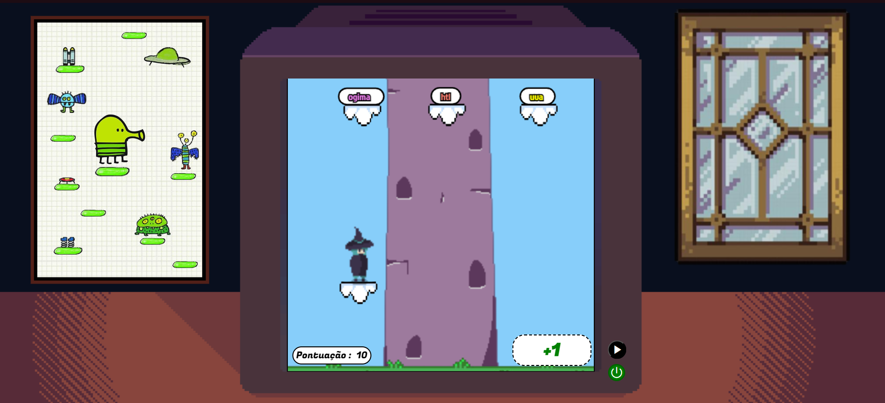

> # MAGIC WORDS
> 
Magic words é um jogo de digitação de palavras, onde, ao acertar palavras, o personagem pula de plataforma e ganha pontos.


  
Rankeamento no modo **high score**, onde ganha o jogador que fizer mais pontos um uma única partida.

---

### Configurar a aplicação

Antes de tudo, certifique-se de ter o MySQL, Apache e o PHP instalado em sua máquina.

Em seguida, clonar o repositório na raíz do Apache, `/var/www/html`:

```

git clone https://github.com/rodrigovalest/web1-trabfinal.git

```

Copiar o arquivo `credentials.example.php`, colar na mesma pasta como `credentials.php` e editar com suas variáveis de ambiente

```

cp credentials.example.php credentials.php;

```
---

### Notas da Atualização - (09/01/2024)

- Jogo
-- [Add] Hud de Power ups demonstrando qual power ups o player possui.
--[Add] Sistema de tempo onde no começo do jogo ou quando o player reviver ele terá um tempo limitado parado antes de começar a cair.
-- [Add] Botão de Pausa
-- [Mod] Alteração no jeito de demonstrar a pontuação, alterando ser dentro do canvas para um elemento fora dele.
-- [Mod] Alteração no modo de criação de plataformas, agora tendo em conta com a velocidade das plataformas.
-- [Mod] Alteração no modo de posicionar o player no começo do jogo e quando reviver.
-- [Mod] Background mais claro
-- [Mod] Game over agora com pontuação
-- [Mod] Cores dos Power ups
-- [Mod] Fontes dos textos
-- [Mod] Reorganização da parte de cima da tela para não hover conflitos com zoom
-- [Bugfix] Espaço não aparecendo 
-- [Bugfix] Power ups não funcionando ou acabando mais cedo

- Tela Inicial
-- [Add] Parte de Manual e Créditos feito com Bootstrap
-- [Mod] Fontes dos texto
-- [Mod] Reorganização da parte de cima da tela para não hover conflitos com zoom
---
Rodrigo do Vale Stankowicz
Matheus Nunes Santana